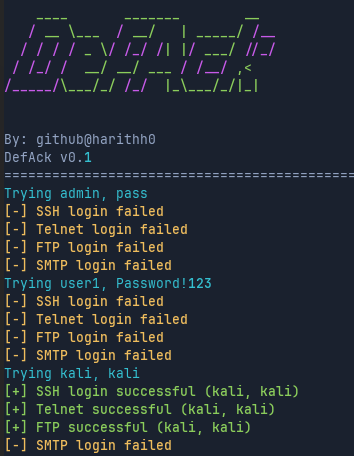

## About
A lightweight Python tool to test default or weak credentials across multiple services (SSH, FTP, Telnet, SMTP) on a target host.

> ⚠️ For educational and authorized penetration testing use only.


## 🚀 Features
Test credentials against:
    SSH
    FTP
    Telnet
    SMTP
- Supports custom or default credential lists
- Optional fail-ignore mode
- Easy CLI interface with argparse
- Color-coded output with rich

## Example

## 🛠️ Usage

```bash
python defack.py [OPTIONS] <target-ip>
```

### Basic Examples:

Use all protocols:

```bash
python defack.py -a 192.168.1.1
```

Use specific services:

```bash
python defack.py -s -f 192.168.1.1
```

Use custom credentials:

```bash
python defack.py -s -x creds.txt 192.168.1.1
```

Ignore failed logins:

```bash
python defack.py -a -i 192.168.1.1
```



## Credential Format
Your credential file should be a .txt file with one username password pair per line, like:
```
admin admin
root toor
```
## 📜 License

MIT License
